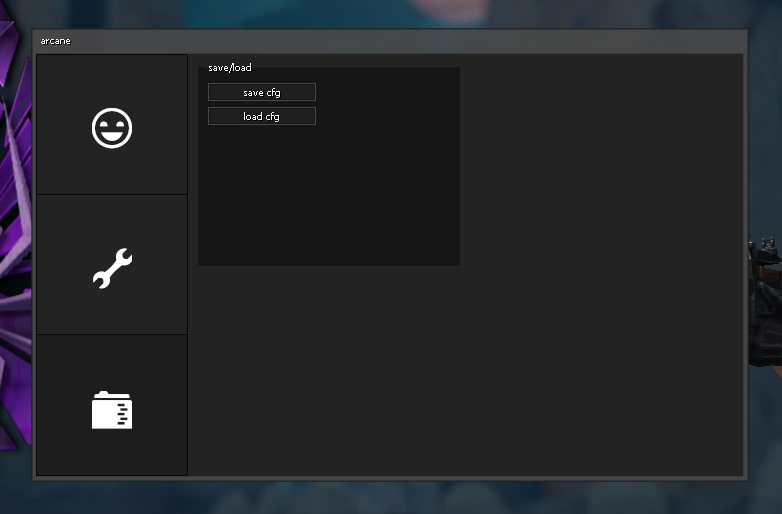

# arcane      

***

***

&nbsp;

**Hooked functions**
- Frame stage notify
- Create move
- Override view
- Scene end
- Emit sound
- Paint traverse

&nbsp;

**Features**
- Show enemy player name
- Show enemy player health
- Show enemy player armor value
- Show if enemy player is scoped or not
- Flash alpha modifier
- View model fov modifier
- Auto bunny hop
- Rank revealer
- Grenade preview
- Disconnect to lobby button
- Watermark
- Ability to save/load configs
- Netvar manager (No need to manually update offsets)

&nbsp;

**Info**
- Click [here](https://github.com/iFloody/fgui/wiki) to read the FGUI docs.
- Click [here](https://www.dafont.com/heydings-icons.font) to download the font required for the GUI tabs.
